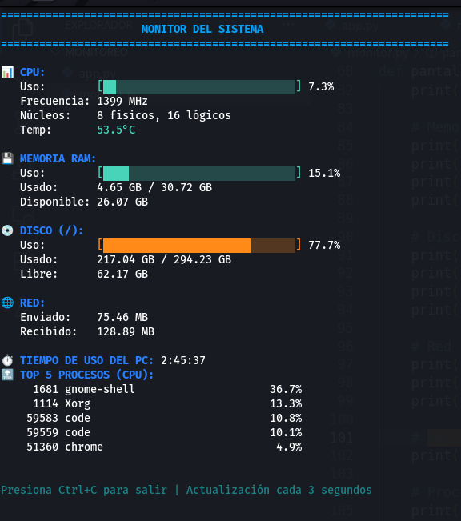

# 🖥️ sysmon

> Monitor simple y claro del sistema para Linux. Sin ruido, solo la información que necesitas.

[](https://opensource.org/licenses/MIT)
[](https://www.python.org/downloads/)



## 🎯 ¿Por qué sysmon?

Cansado de herramientas complejas con demasiada información? **sysmon** te muestra solo lo esencial de forma clara y visual.

- ✨ Sin parpadeos molestos
- 🎨 Colores intuitivos (verde ➜ amarillo ➜ rojo)
- 📊 Barras de progreso visuales
- ⚡ Actualización en tiempo real
- 🚀 Ligero y rápido

## ✨ Características

| Característica | Descripción |
|---------------|-------------|
| 📊 **CPU** | Uso, frecuencia, núcleos y temperatura |
| 💾 **RAM** | Memoria usada, disponible y porcentaje |
| 💿 **Disco** | Espacio usado, libre y porcentaje |
| 🌐 **Red** | Datos enviados y recibidos |
| ⏱️ **Uptime** | Tiempo de uso del PC |
| 🔝 **Procesos** | Top 5 procesos por uso de CPU |

## 🚀 Instalación

### Método 1: Instalación automática (Recomendado)

```bash
# Clonar el repositorio
git clone https://github.com/tuusuario/sysmon.git
cd sysmon

# Ejecutar el instalador
chmod +x install.sh
sudo ./install.sh
```

### Método 2: Instalación manual

```bash
# Instalar psutil
pip3 install psutil

# Copiar a /usr/local/bin
sudo cp sysmon.py /usr/local/bin/sysmon
sudo chmod +x /usr/local/bin/sysmon
```

### Método 3: Uso sin instalar

```bash
# Instalar solo las dependencias
pip3 install psutil

# Ejecutar directamente
python3 sysmon.py
```

## 💻 Uso

Una vez instalado, simplemente ejecuta:

```bash
sysmon
```

**Salir:** Presiona `Ctrl+C`

## 📋 Requisitos

- **Sistema Operativo:** Linux (cualquier distribución)
- **Python:** 3.6 o superior
- **Dependencias:** psutil (se instala automáticamente)

### Distribuciones probadas:
- ✅ Ubuntu / Debian
- ✅ Fedora / RHEL
- ✅ Arch Linux
- ✅ Linux Mint
- ✅ Pop!_OS

## 🎨 Personalización

### Cambiar la frecuencia de actualización

Edita el archivo `sysmon.py` y busca esta línea:

```python
time.sleep(3)  # Actualiza cada 3 segundos
```

Cambia el `3` por el número de segundos que prefieras:
- `1` = Actualización muy rápida (más uso de CPU)
- `3` = Equilibrado (recomendado)
- `5` = Actualización más lenta (menos uso de CPU)

## 📊 Indicadores de color

Los colores te ayudan a identificar el estado del sistema de un vistazo:

- 🟢 **Verde:** Todo bien (< 50%)
- 🟡 **Amarillo:** Uso moderado (50-80%)
- 🔴 **Rojo:** Uso alto (> 80%)

## 🗑️ Desinstalación

```bash
sudo rm /usr/local/bin/sysmon
```

## 🐛 Solución de problemas

### "psutil no está instalado"
```bash
pip3 install psutil
# o
sudo apt install python3-psutil
```

### "Permiso denegado"
Asegúrate de ejecutar el instalador con `sudo`:
```bash
sudo ./install.sh
```

### "No se muestra la temperatura"
Algunos sistemas no exponen la temperatura del CPU. Esto es normal y no afecta el funcionamiento.

## 🤝 Contribuir

Las contribuciones son bienvenidas! Puedes:

1. 🐛 Reportar bugs
2. 💡 Sugerir nuevas características
3. 🔧 Enviar pull requests
4. 📖 Mejorar la documentación

### Cómo contribuir:

```bash
# Fork el proyecto
git clone https://github.com/tuusuario/sysmon.git
cd sysmon

# Crear una rama
git checkout -b mi-nueva-funcionalidad

# Hacer cambios y commit
git commit -am 'Añadir nueva funcionalidad'

# Push a la rama
git push origin mi-nueva-funcionalidad

# Crear Pull Request en GitHub
```

## 📝 Changelog

### v1.0.0 (2025-10-15)
- 🎉 Lanzamiento inicial
- ✨ Monitor básico con CPU, RAM, Disco, Red
- 📊 Barras de progreso visuales
- 🎨 Sistema de colores intuitivo
- ⚡ Actualización sin parpadeos

## 📄 Licencia

Este proyecto está bajo la Licencia MIT. Ver el archivo [LICENSE](LICENSE) para más detalles.

## 🙏 Agradecimientos

- Inspirado en `htop`, `top`, y `glances`
- Construido con [psutil](https://github.com/giampaolo/psutil)
- Gracias a todos los contribuidores

## 👨‍💻 Autor

Creado con ❤️ por [Tu Nombre]

---

<div align="center">

**¿Te gusta sysmon?** Dale una ⭐ en GitHub!

[Reportar Bug](https://github.com/tuusuario/sysmon/issues) · [Solicitar Feature](https://github.com/tuusuario/sysmon/issues) · [Documentación](https://github.com/tuusuario/sysmon/wiki)

</div># sysmon
